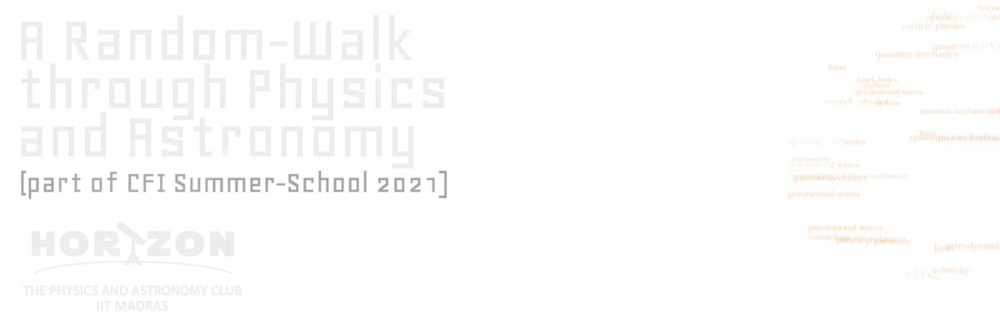

# Table of Contents

1.  [Horizon](#org4cec39f)
2.  [Time-Table](#org229ade1)
3.  [Mini-Projects](#org224cef5)
4.  [Microsoft Teams](#org676b3f6)
5.  [Resource](#org5f94d04)

# Horizon

- Abode for Physics, Astronomy and Science enthusiasts in IITM.
- Talks, Seminars, Workshops, and other events.
- Promote scientific temperament among GSB.
- Early access to &ldquo;research experience&rdquo;.

# Time-Table

<table border="2" cellspacing="0" cellpadding="6" rules="groups" frame="hsides">

<colgroup>
<col  class="org-left" />

<col  class="org-right" />

<col  class="org-left" />
</colgroup>
<thead>
<tr>
<th scope="col" class="org-left"><b>Date</b></th>
<th scope="col" class="org-right"><b>Module</b></th>
<th scope="col" class="org-left"><b>Topic</b></th>
</tr>
</thead>

<tbody>
<tr>
<td class="org-left">07/07/2021</td>
<td class="org-right">1.1</td>
<td class="org-left">Linux</td>
</tr>

<tr>
<td class="org-left">09/07/2021</td>
<td class="org-right">1.2</td>
<td class="org-left">Python</td>
</tr>

<tr>
<td class="org-left">12/07/2021</td>
<td class="org-right">1.3</td>
<td class="org-left">Hands-On Astronomy</td>
</tr>
</tbody>

<tbody>
<tr>
<td class="org-left">14/07/2021</td>
<td class="org-right">2.1</td>
<td class="org-left">Quantum Physics</td>
</tr>

<tr>
<td class="org-left">16/07/2021</td>
<td class="org-right">2.2</td>
<td class="org-left">Orbital Mechanics &amp; Exoplanets</td>
</tr>

<tr>
<td class="org-left">18/07/2021</td>
<td class="org-right">2.3</td>
<td class="org-left">Particle Physics Part-I</td>
</tr>

<tr>
<td class="org-left">19/07/2021</td>
<td class="org-right">&#xa0;</td>
<td class="org-left">Particle Physics Part-II</td>
</tr>
</tbody>

<tbody>
<tr>
<td class="org-left">20/07/2021</td>
<td class="org-right">3.1</td>
<td class="org-left">Relativity and Cosmology Part-I</td>
</tr>

<tr>
<td class="org-left">21/07/2021</td>
<td class="org-right">&#xa0;</td>
<td class="org-left">Relativity and Cosmology Part-II</td>
</tr>

<tr>
<td class="org-left">23/07/2021</td>
<td class="org-right">3.2</td>
<td class="org-left">Applications of QM</td>
</tr>

<tr>
<td class="org-left">25/07/2021</td>
<td class="org-right">3.3</td>
<td class="org-left">Black Holes &amp; Gravitational Waves Part-I</td>
</tr>

<tr>
<td class="org-left">26/07/2021</td>
<td class="org-right">&#xa0;</td>
<td class="org-left">Black Holes &amp; Gravitational Waves Part-II</td>
</tr>

<tr>
<td class="org-left">31/07/2021</td>
<td class="org-right">&#xa0;</td>
<td class="org-left">Mini-Project Presentation and Review</td>
</tr>
</tbody>
</table>

# Mini-Projects

- Topics based on the Modules.
- Group participation only - 5-4 members per group.
- Module preference entered in google-form.
- Mentors are instructors.
- Each group will have a mentor.
- Participants can contact mentors for doubts and tutorials.

# Microsoft Teams

- Channels - for different dicussions topics.
- Classes will be from **Classes** channels.
- Participants can request schedule tutorial(+doubt clarification) from
  instructors.
- The admins in the WhatsApp group are the instructors - for urgent contact.

# Resource

- [GitHub Repository for Summer School](https://github.com/HorizonIITM/summer-school-2021)
