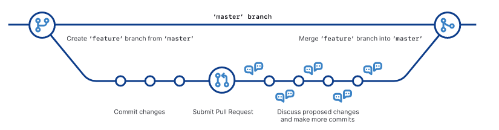

# Table of Contents

1.  [Commandline](#orgd66688b)
    1.  [File system navigation](#orgff2b603)
    2.  [File system manipulation](#orgd015f24)
        1.  [touch - Creating Files, and modifying access times](#orgc9b36ca)
        2.  [cp - Copying](#orgbd84782)
        3.  [mv - Moving and Renaming](#org2e0cd95)
        4.  [mkdir - Create Directories](#orgdb84040)
        5.  [rm - Delete files and directories](#org24fc326)
    3.  [Commandline help](#orgd071f4b)
        1.  [Aliases](#org396007f)
    4.  [Stream Commands and Piping](#org1caef26)
        1.  [Redirecting out and errors](#org0c6ad44)
        2.  [Redirecting input](#org372062d)
        3.  [Pipelines](#org8682b74)
    5.  [Filters](#org66f4604)
    6.  [Expansions](#orgc1a6ee9)
    7.  [Finding files](#org513c708)
        1.  [locate](#org1040815)
        2.  [find](#org97bf883)
    8.  [Archives](#orgcaadea0)
        1.  [Compression](#org4e47994)
        2.  [Archiving](#org153caf0)
2.  [Version Control](#orgab47708)
    1.  [Why do we need it?](#orgec3e259)
    2.  [Git](#org6bfcd0d)
        1.  [Git configuration](#org21cc338)
        2.  [Creating repositories](#orgf63bd88)
        3.  [Branches](#org062783a)
        4.  [Changes](#org738bc97)
        5.  [GitHub](#orga790685)
        6.  [Reverting commits](#org56067f5)
        7.  [Pull-requests and forks](#org60b1110)

<a id="orgd66688b"></a>

# Commandline

- **Shell** - a program which faciliates the communication to the system
- Terminal:Shell `::` Phone:Language
- Bash - Bourne Again SHell - most common (and) default.
- General structure of a command:
  `command -options arguments`

<a id="orgff2b603"></a>

## File system navigation

- Example file system structure:

```
  .
  ├── images
  │   ├── dec-vt100.jpg
  │   ├── fsf.png
  │   ├── git-flow.png
  │   ├── gnome-terminal.png
  │   ├── gnu.png
  │   ├── linus.jpg
  │   ├── open-source-iniative.png
  │   └── stallman.png
  ├── linux-01.md
  ├── linux-01.org
  ├── linux.md
  ├── linux.org
  ├── linux.txt
  └── virtualbox-and-ubuntu.org
```

- `pwd` - print current working directory
- `ls` - list files and subdirectories
- `cd` - change directory
  - `cd /path/to/target`
- Paths are two types:
  1.  Absolute - referred from the `root` (`/`)
  2.  Relative - referred from the current directory.
- Relative pathname notation:
  1.  `.` - _current_ directory
  2.  `..` - _parent_ directory
- `file` - prints information about file
- `less` - terminal pager for viewing text files

<a id="orgd015f24"></a>

## File system manipulation

<a id="orgc9b36ca"></a>

### touch - Creating Files, and modifying access times

- `touch file` - If file exists, changes access and modification time, if not
  creates empty file &ldquo;file&rdquo;
- `touch -c file` - Previous one, but don&rsquo;t create file if it doesn&rsquo;t exist.
- `touch -a file` - Change only access time
- `touch -m file` - Change only modification time
- `touch -t STAMP file` - Sets the time to STAMP instead of current time (UTC

- `touch -d DATE file` - Sets the time to DATE string, multiple formats possible.

<a id="orgbd84782"></a>

### cp - Copying

- `cp source desination`
- `cp -r source destination` - for recursively copying directories
- `cp -i source destination` - for prompting overwrite confirmations
- `cp -u source destination` - for copying only new files
- `cp source1 source2 destination` - for copying multiple files

<a id="org2e0cd95"></a>

### mv - Moving and Renaming

- `mv source destination` - for both moving and renaming files
- `mv source1 source2 destination` - for moving multiple files

<a id="orgdb84040"></a>

### mkdir - Create Directories

- `mkdir dir1`
- `mkdir dir1 dir2 dir3` - for creating multiple directories

<a id="org24fc326"></a>

### rm - Delete files and directories

- `rm file` - removes file. If it is folder, it throws up error
- `rm -r folder` - removes folder by recursively deleting all contents

<a id="orgd071f4b"></a>

## Commandline help

- Four different (standard) command types:
  1.  Executable
  2.  Shell Built-in
  3.  Shell Function
  4.  Alias
- The types can be checked using `type`
- Executable location can be printed using `which`
- Manual pages can be read using `man`
- Relevant commands can be found with keywords using `apropos`

<a id="org396007f"></a>

### Aliases

- Some commands can be given an _alias_, for efficiency
- `alias name='command to alias'`

<a id="org1caef26"></a>

## Stream Commands and Piping

- Everything is file in linux, and every data is plain text.

```
      stdin
        │
        │
   ┌────▼────┐
   │ command │
   └─┬─────┬─┘
     │     │
     ▼     ▼
  stdout stderr
```

- Data communication _into_ is **stdin**
- Data communication _out of_ is **stdout** and **stderr**
- These can be piped anyhow.

```
          ┌──────────┐ ┌──────────┐
  stdin ──► command1 ├─► command2 ├─► stdout
          └─────┬────┘ └─────┬────┘
                │            │
                ▼            ▼
             stderr       stderr
```

<a id="org0c6ad44"></a>

### Redirecting out and errors

- `command > out` - redirects **stdout** of command to file &ldquo;out&rdquo; as text.
- `>` rewrites the target file on each redirection.
- `>>` appends the redirection to the target file.
- Each stream has an integer associated called **file descriptor**:

  <!-- This HTML table template is generated by emacs 27.2 -->
  <table border="1">
    <tr>
      <td align="left" valign="top">
        &nbsp;Value&nbsp;
      </td>
      <td align="left" valign="top">
        &nbsp;Stream&nbsp;
      </td>
    </tr>
    <tr>
      <td align="left" valign="top">
        &nbsp;&nbsp;&nbsp;&nbsp;&nbsp;0&nbsp;<br />
        &nbsp;&nbsp;&nbsp;&nbsp;&nbsp;1&nbsp;<br />
        &nbsp;&nbsp;&nbsp;&nbsp;&nbsp;2&nbsp;
      </td>
    </tr>
  </table>

- To redirect **stderr** prepend integer value to `>`:
  `command 2> file` - redirects error of command to file
- To redirect both **stdout** and **stderr**:
  `command &> file`, or alternatively
  `command > file 2>&1`
- Stream sink `/dev/null` - redirections are silenced and gone, reduced to
  nothing.
  `command 2> /dev/null` - no errors will be displayed.

<a id="org372062d"></a>

### Redirecting input

- **stdin** is the input from keyboard.
- Text can be added to stdin stream using `<`.
  `command < file` - puts content of file in stdin and command uses it.
- `cat` - usually used for concatenating files and put output to **stdout**.
  `cat file1 file2 ... fileN > file`
- `cat` can be used to direct stdin from keyboard to a file:
  `cat > file` - directs whatever typed into &ldquo;file&rdquo;

<a id="org8682b74"></a>

### Pipelines

- `command1 | command2` - stdout of command1 is stdin of command2

<a id="org66f4604"></a>

## Filters

- **sort:** Sorts the stdout and writes to stdout
- **uniq:** Removes duplicates from data in stdout
- **wc:** Displays number of lines, words, and bytes
- **grep:** Filtering based on patterns
- **head:** Prints first part of the file
- **tail:** Prints last part of the file, also tails the file.
- **tee:** Inserts tee-fitting in the pipeline: redirects to file _and_ stdout.
- **cut:** Slice text streams based on index, or field separator.

<a id="orgc1a6ee9"></a>

## Expansions

- `echo` - analogous to print function from various langauges.
- `*` - expands to &ldquo;all files/folders&rdquo;
- `~` - expands to user&rsquo;s home folder
- `$((expression))` - expands the arithmetic expression &ldquo;expression&rdquo;
- `{el1,el2,el3}` - iterates command using each element between the braces:
  `echo {1..5}` - prints 1 till 5
  `echo {A..Z}` - prints A to Z
  `echo {A..Z}{01..10}` - prints A01 to Z10
- Double quotes keep only parameter expansion, arithmetic expansion, and
  command substitution.
- `$(command)` - substitutes the text with result of command &ldquo;command&rdquo;
- Single quotes prevent all expansions.
- Escape (sequences)

<a id="org513c708"></a>

## Finding files

<a id="org1040815"></a>

### locate

- `locate name` - searches for any file with the given name &ldquo;name&rdquo;
- This happens by using a database which locate maintains.
- This database is updated periodically automatically - manually it can be done
  by running `updatedb` as superuser.

<a id="org97bf883"></a>

### find

- Provides more fine control.
- `find dir` - lists all the folders and files under the directory &ldquo;dir&rdquo;
- We can specify the type of files to list:
  - `find dir -type d` - displays only directories
  - `find dir -type f` - displays only files
- We can specify name pattern to search (or not search) for:
  - `find dir -name pattern` - searches and prints those which match pattern
  - `find dir -not -name pattern` - searches and prints those which do not match
    pattern

<a id="orgcaadea0"></a>

## Archives

<a id="org4e47994"></a>

### Compression

- Two main tools available:
  1.  `gzip` - .gz format
  2.  `bzip2` - .bz2 format, smaller and slower.
- gzip:
  - `gzip file` - compresses file to file.gz
  - `gzip -d file` - decompreses file.gz to file.
    Alternative is `gunzip file`.
  - `gzip -c file` - write to stdout.
  - `gzip -l file` - list compression stats for files in file.gz.
  - `gunzip -c file` - outputs file to stdout, acts like cat for .gz files.
    Alternative is `zcat file`. To view the output using a pager, use
    `zless file`.

<a id="org153caf0"></a>

### Archiving

- Compressing multiple files/folders into a single archive.
- Main tools: `tar`, `zip`
- tar - Tape ARchive.
- Tar command structure: `tar mode[options] pathname`
- Tar modes:

  <table border="2" cellspacing="0" cellpadding="6" rules="groups" frame="hsides">

  <colgroup>
  <col  class="org-left" />

  <col  class="org-left" />
  </colgroup>
  <thead>
  <tr>
  <th scope="col" class="org-left"><b>Mode</b></th>
  <th scope="col" class="org-left"><b>Description</b></th>
  </tr>
  </thead>

  <tbody>
  <tr>
  <td class="org-left">c</td>
  <td class="org-left">Create</td>
  </tr>

  <tr>
  <td class="org-left">x</td>
  <td class="org-left">Extract</td>
  </tr>

  <tr>
  <td class="org-left">r</td>
  <td class="org-left">Append</td>
  </tr>

  <tr>
  <td class="org-left">t</td>
  <td class="org-left">List</td>
  </tr>
  </tbody>
  </table>

- Tar commands:
  - `tar cf archivename pathname` - creates archive named &ldquo;archivename&rdquo; of the
    path &ldquo;pathname&rdquo;
  - `tar xf archivename` - extracts archivename to current directory.
- zip command structure: `zip options zipfile file`.
- zip commands:
  - `zip zipfile file` - zips file to zipfile, also appends
  - `zip -r zipfile file1 file2` - zips file1 and file2 into zipfile
  - `zip -r zipfile folder` - zips folder into zipfile
  - `zip -e zipfile file` - encrypted archive zipfile of file
- unzip commands:
  - `unzip zipfile` - unzips zipfile
  - `unzip zipfile -d path` - unzips zipfile into path
  - `unzip -l zipfile` - lists content of zipfile without extracting

<a id="orgab47708"></a>

# Version Control

<a id="orgec3e259"></a>

## Why do we need it?

- Software development gets complicated with increase in size of project.
- Concept of &ldquo;undo&rdquo; exists only within the context of a editor.
- Needs may arise to try two different design choices simultaneously.
- Making a lot of changes at one time, if the code breaks, difficult to debug.

<a id="org6bfcd0d"></a>

## Git

- One such version control system.
- Created by _Linus Torvalds_ for devloping Linux kernel.
- Development process can be explained by graphs:



<a id="org21cc338"></a>

### Git configuration

- The first time git is used to commit, it asks for credentials.
- Setting-up config:
  `git config --global user.name "your-name"` - Setting user name
  `git config --global user.email "mail@address.com"` - Setting email address

<a id="orgf63bd88"></a>

### Creating repositories

- You can initialise a local repository in a folder:
  `git init`
- Or you can clone an existing repository from any VCS:
  `git clone url`

<a id="org062783a"></a>

### Branches

- Default branch name in git used to be **master**, but it may have been / can be
  changed to other things like **main**, **trunk** or **development**.
- Check branch with `git status`
- Branches can be created using:
  `git branch branch-name`
- Branches are activated by &ldquo;checking-out&rdquo;:
  `git checkout branch-name`
- Any branch can be merged with the current branch using:
  `git merge branch-name`, where &ldquo;branch-name&rdquo; is the branch to merge with current
  one
- Current branch can be renamed using:
  `git branch -m new-name`
- Specified branch can be deleted using:
  `git branch -d branch-name`

<a id="org738bc97"></a>

### Changes

- Untracked files can be added to track in the version control using
  `git add file`
- All changed files can be added using
  `git add -u`
- All files in a directory can be added using
  `git add .`
- Changes can be committed to the branch using
  `git commit` - this prompts with an editor to specify the commit message
  `git commit -m "message"` - this takes the &ldquo;message&rdquo; as the short commit
  message

<a id="orga790685"></a>

### GitHub

- Provides internet hosting for version control using git.
- Local repository can be linked to a &ldquo;remote&rdquo; repository from GitHub:
  `git remote add remote-name remote-repo-url`, remote-name is usually kept as
  &ldquo;origin&rdquo;
- There can be more than one remote, but the working directory can have files
  only from one remote at a time. Changing remotes changes file to that remote
  files.
- All change histories from the remote branches can be downloaded using:
  `git fetch`
- First time pushing to remote repository will prompt for credentials. Important
  points:
  1.  Depending upon the default configuration of git, your passwords may/may not
      be cached locally. This means future pushing may not/may ask for
      credentials again.
  2.  If you have 2FA set-up in your GitHub account, you cannot push using
      password. You need to obtain PAT from GitHub, and use that as password
      instead. PAT (Personal Access Token) is a usage-specific password sort-of,
      so do not share it with anyone.
- Local branch commits can be pushed to the remote repo using:
  `git push` - this pushes to the default branch of the default remote
  `git push remote-name branch-name` - pushes to the &ldquo;branch-name&rdquo; branch of
  &ldquo;remote-name&rdquo; remote repository.
- New changes/commits in the remote repository can be downloaded and applied
  to your local working tree using:
  `git pull` - this pulls from default branch of default remote
  `git pull remote-name branch-name` - self-explanatory.
- `git pull` is a combination of `git fetch` and `git merge`.

<a id="org56067f5"></a>

### Reverting commits

- Reset commit while leaving the local changes unaffected:
  `git reset commit-name`
- Reset commit while also reverting local changesaa:
  `git reset --hard commit-name`

<a id="org60b1110"></a>

### Pull-requests and forks

- Forking - making a copy of repository in own account.
- Changes made in a forked repository can be requested to be taken into
  the original repository by using **pull requests**
- Changes in the original repository can be synced to the forked repository
  by setting an **upstream**:
  1.  Switch to master branch in your local cloned forked repository.
      `git checkout master`
  2.  Add the remote of the original repository (commonly named as &ldquo;upstream&rdquo;)
      `git remote add upstream url`
  3.  Fetch the changes/history from the original repository
      `git fetch upstream`
  4.  Merge the fetched changes into our local master branch
      `git merge upstream/master`
