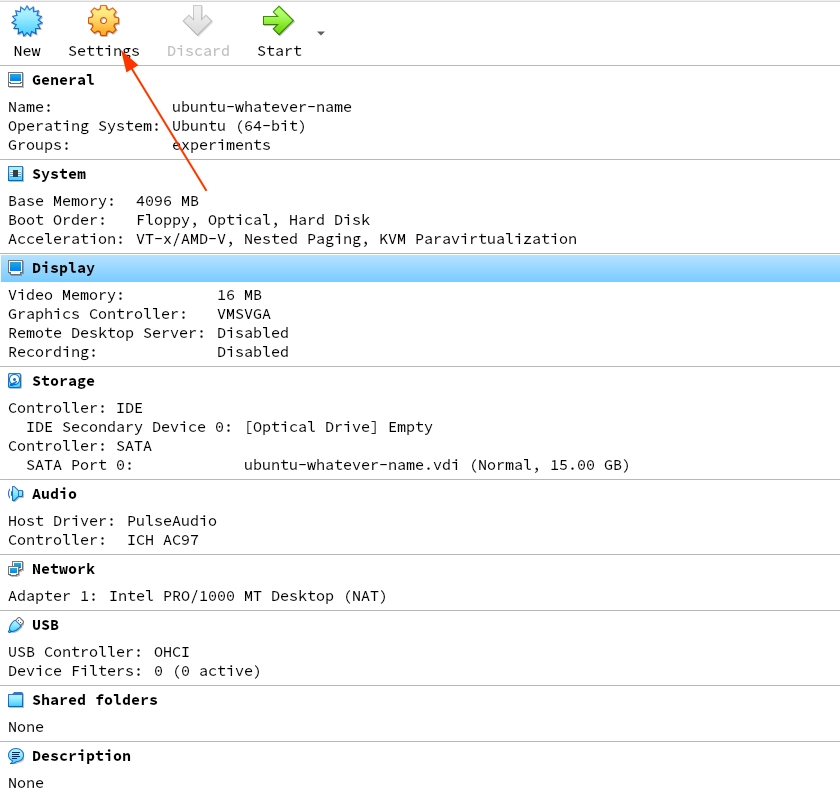

# Table of Contents

1.  [VirtualBox installation](#org482945a)
2.  [Ubuntu Installation](#orgcd03261)
3.  [Fixing Screen Resolution](#org12c1126)

# VirtualBox installation

1.  Download installer [from here](https://download.virtualbox.org/virtualbox/6.1.22/VirtualBox-6.1.22-144080-Win.exe).
2.  Install it.

# Ubuntu Installation

1.  Open VirtualBox.
2.  Click `New`.
    
3.  Give name for the virtual machine, and choose a folder to store the virtual
    machine.
    **Pro tip**: having &ldquo;Ubuntu&rdquo; in the name will automatically select the type and
    version.
    
4.  Specify memory.
    **Pro tip**: specify 25% of your host system memory e.g. if your system has 8GB
    RAM, specify 2GB. Never specify more than 6GB RAM, even if you have 24GB+
    RAM in your host system.
    
5.  Choose `Create a hard disk now`.
    
6.  Choose `VDI (VirtualBox Disk Image)`.
    
7.  Choose `Dynamically Allocate`.
    
8.  Specify hard disk **file location** and and storage size.
    **Pro tip**: 15GB should suit well for this summer-school (and any VM Ubuntu
    testing)
    
9.  Open `Settings`.
    
10. Go to `Display`.
    
11. Check `Enable 3D Acceleration`.
    
12. Go-to `Storage`.
    
13. Click `New optical disc` icon.
    
14. Click `Add disk` and choose the Ubuntu .iso file that you downloaded.
    
15. Select the .iso you chose, and click `Choose`.
    
16. Click `OK`.
    
17. Click `Start`.
    
18. Choose **Ubuntu** and press `Enter`.
    
19. Click `Install Ubuntu`.
    
20. Continue [from here](https://ubuntu.com/tutorials/install-ubuntu-desktop#5-prepare-to-install-ubuntu).

# Fixing Screen Resolution

1.  Update the system first using:
    `sudo apt update` - sudo is for administrator priveleges, apt is the package
    manager, and you&rsquo;re telling it to update.
2.  Install the guest-additions package using:
    `sudo apt install virtualbox-guest-dkms` - you can do this, or you can choose
    `Device > Insert Guest Additions`, and click `Run` in the popup. But it is better
    to install using command, as it will install the dependencies too, which
    the latter won&rsquo;t do, and will throw up error.

- If you did using `Device > Insert Guest Additions`, and got error. Install the
  packages mentioned there using:
  `sudo apt install gcc make perl`.
- Then close the terminal, eject all discs that are inserted - either using the
  `Disks` application, or from VirtualBox settings (Storage section).
- Reboot the virtual machine, if it doesn&rsquo;t automatically resize the screen,
  go to settings and change resolution.
