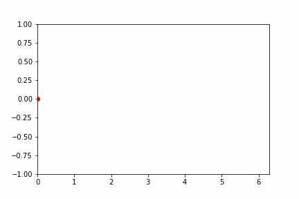
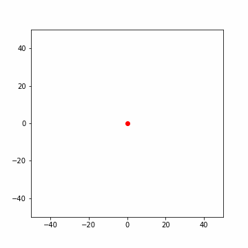
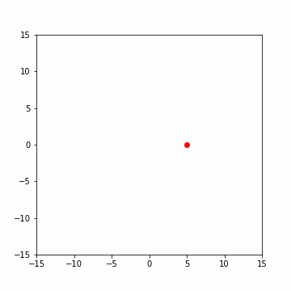

# Module 2.2 - 16/07/2021

# Orbital Mechanics and Exoplanets

### _Hrishabh Srivastava_ and _Varun Kumar_

---

## Orbital Mechanics Overview

1. History
2. Kepler's laws of planetary motion
3. Two body problem
4. Types of orbits
5. Orbital Maneuvers
6. Animating Hohmann transfer

---

## Exoplanets Overview

1. Exoplanets and their types
2. Why exoplanets?
3. Methods of Detection
4. Famous Missions
5. NASA Exoplanet Archive
6. Gaia Data Release

---

## Programs

- [Python code for sine animation](./programs/sine-animation.py)
- [Python code for spiral animation](./programs/spiral-animation.py)

---

## Plots

- Animation of Sine function

  

- Spiral animation

  

- Hohmann transfer trajectory animation

  

---

## Resources

### Slides and Notes

- [Slides for Orbital Mechanics](./orbital-mechanics.pdf)
- [Slides for Exoplanets](./exoplanets.pdf)

### References

- [Matplotlib animation tutorial](https://www.youtube.com/watch?v=GtZxk8Wa3Jw)
- [matplotlib.animation](https://matplotlib.org/stable/api/animation_api.html)
- [matplotlib.animation.FuncAnimation](https://matplotlib.org/stable/api/_as_gen/matplotlib.animation.FuncAnimation.html)
- Orbital Mechanics for Engineering Students, _Howard D. Curtis_
